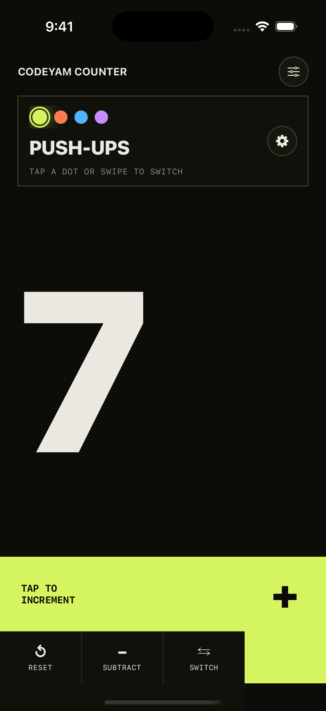
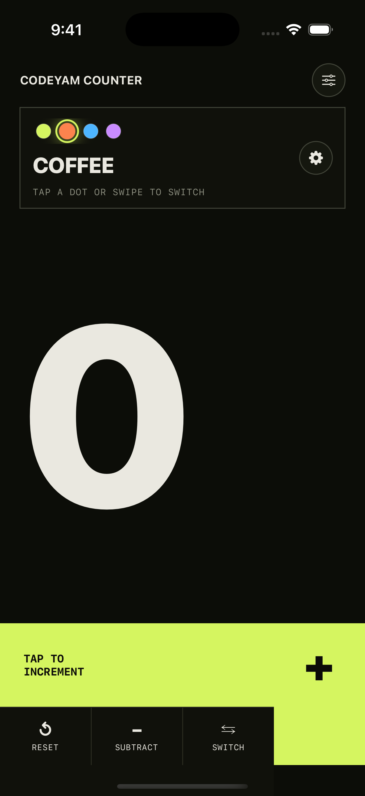
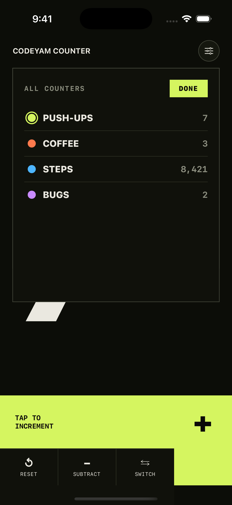
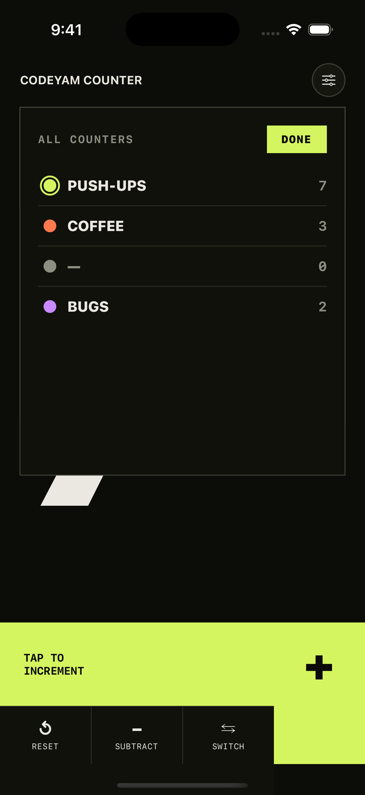
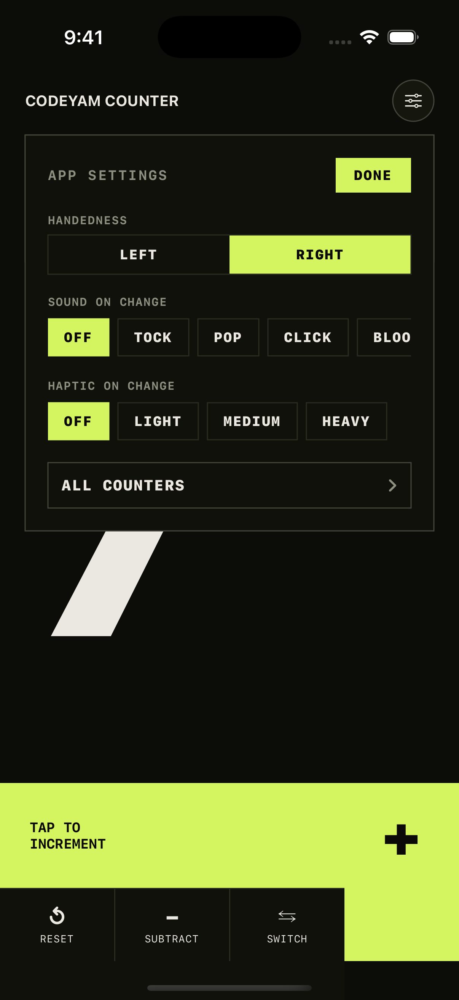
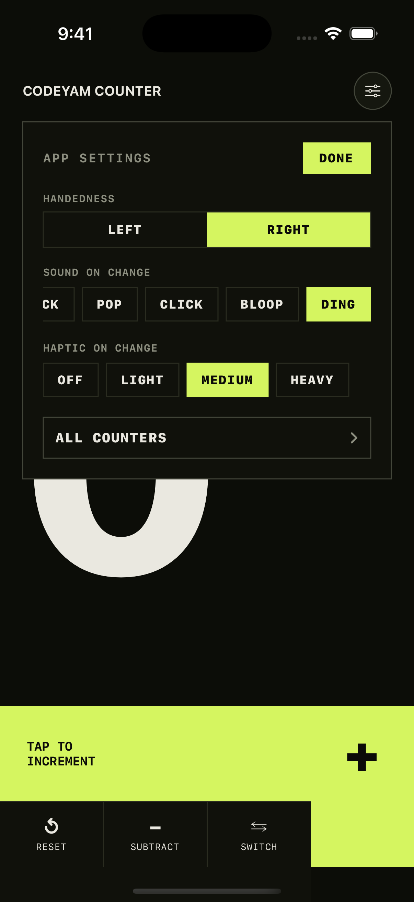
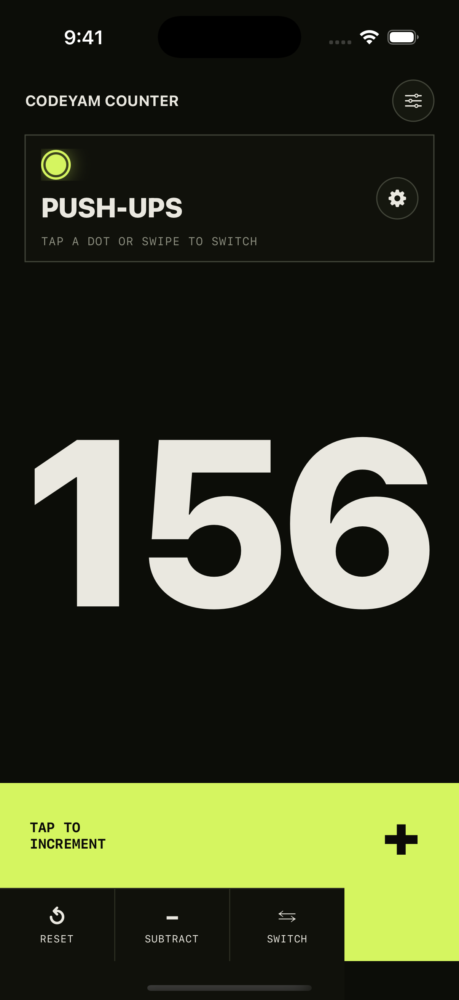
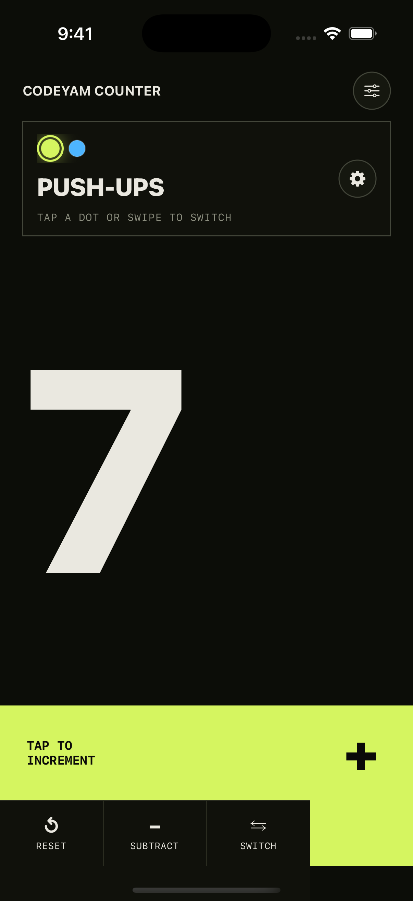

# Swift + SwiftUI iOS App

A native iOS application using SwiftUI and a shared SwiftPM AppCore library.

## Testing

Write tests with **XCTest** (`import XCTest`, `final class …: XCTestCase`,
`func testName()`). XCTest is the framework the editor's runner captures: the
editor parses the XCTest `--xunit-output` file, and **swift-testing** (`import
Testing`, `@Test func`) results do **not** reliably land there on Xcode 16.x /
Swift 6.x — under `--parallel`, the swift-testing run can overwrite the xunit
with `tests="0"`, so the editor sees no tests. Put your tests in
`Tests/AppCoreTests/` with a `//` comment directly above each `func testX()`
describing what it verifies (the editor parses that comment as the test's
description).

Tests run via:

    swift test --parallel --disable-swift-testing --xunit-output .codeyam/swift-tests.xml

- `--parallel` is required: modern SwiftPM only writes the XCTest xunit to
  `--xunit-output` when run in parallel, so without it the project reports
  zero tests.
- `--disable-swift-testing` makes the xunit deterministic: it stops the
  swift-testing harness from also claiming `--xunit-output` and racing the
  XCTest writer, which otherwise nondeterministically truncates the file to
  `tests="0"`.

To register your tests with the editor after writing them, run:

    codeyam-editor editor reconcile-registry --auto-apply

This diffs the runner output against the registry and auto-adds new tests —
line numbers and descriptions are resolved automatically, so you do not need
to pass `--line` by hand.

## Contributing

Contributions are welcome! Please read [CONTRIBUTING.md](CONTRIBUTING.md) for
build/test instructions and the PR process, and note our
[Code of Conduct](CODE_OF_CONDUCT.md). To report a security issue, see
[SECURITY.md](SECURITY.md).

## License

Released under the [MIT License](LICENSE).

<!-- codeyam:run-and-edit:start -->
## Develop this project with codeyam-editor

This project is built with [codeyam-editor](https://codeyam.com) — code and runnable data scenarios are authored side by side against a live preview.

```bash
# Launch the editor (split-screen terminal + live preview)
codeyam-editor editor

# Run the tests
swift test --parallel --disable-swift-testing --xunit-output .codeyam/swift-tests.xml
```
<!-- codeyam:run-and-edit:end -->

<!-- codeyam:scenario-gallery:start -->
## Scenario gallery

States captured as runnable scenarios with codeyam-editor:

### Counter - Active count



### Counter - All but one deleted



### Counter - All counters list



### Counter - All counters list with blank slot



### Counter - App Settings open



### Counter - App Settings sound and haptic on



### Counter - Blank slot incremented



### Counter - Deleted default ghost slot


<!-- codeyam:scenario-gallery:end -->
