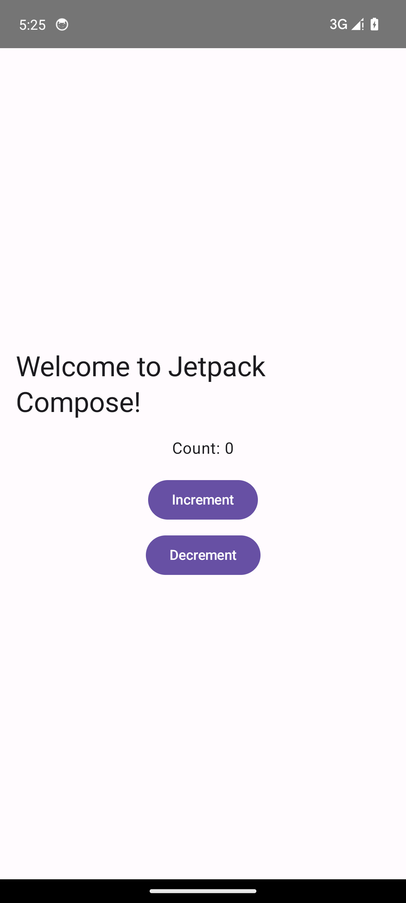
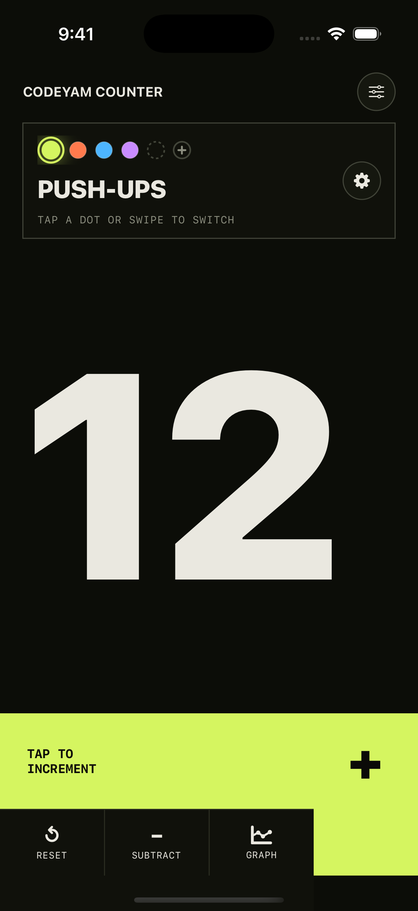

# CodeYam Counter

[](https://github.com/codeyam-ai/codeyam-counter/actions/workflows/ci.yml)
[](./LICENSE)

**A fast, tactile way to count anything.**

CodeYam Counter keeps several running tallies at once — reps, coffees, laps,
anything worth counting. Each counter gets its own name and color, one tap
increments, and every count is charted over time so you can see your history at
a glance.

**[Download CodeYam Counter on the App Store](https://apps.apple.com/us/app/codeyam-counter/id6789247345) — free to use.**

<p align="center">
  <a href="https://apps.apple.com/us/app/codeyam-counter/id6789247345"></a>
</p>

<!-- codeyam:run-and-edit:start -->
## Develop this project with codeyam-editor

This project is built with [codeyam-editor](https://codeyam.com) — code and runnable data scenarios are authored side by side against a live preview.

```bash
# Clone the repo
git clone https://github.com/codeyam-ai/codeyam-counter && cd codeyam-counter

# Install codeyam-editor
npm install -g @codeyam-editor/codeyam-editor@latest

# Launch the editor (split-screen terminal + live preview)
codeyam-editor editor
```
<!-- codeyam:run-and-edit:end -->

## Build and run locally

CodeYam Counter is currently a native iOS app, built with SwiftUI on a shared
`AppCore` SwiftPM library. Building it requires macOS with a recent Xcode
(Swift 6 toolchain) and an iOS 15+ simulator or device.

```bash
# Clone the repo
git clone https://github.com/codeyam-ai/codeyam-counter && cd codeyam-counter

# Build the shared AppCore library and run the tests
swift build --package-path ios
swift test --package-path ios --parallel --disable-swift-testing --xunit-output .codeyam/swift-tests.xml
```

Open `ios/App.xcodeproj` in Xcode and run the **App** scheme on an iOS simulator or
device. See [MOBILE_SETUP.md](MOBILE_SETUP.md) for simulator prerequisites and
[CONTRIBUTING.md](CONTRIBUTING.md) for the full build/test workflow.

### Android (work in progress)

A native Android port lives in [`android/`](android/) — Kotlin + Jetpack Compose
on Gradle. It is currently an empty, runnable shell; the counter logic and UI are
being ported in follow-up work. Build and preview it from the emulator:

```bash
# Compile and run the Android unit tests
android/gradlew -p android compileDebugKotlin
android/gradlew -p android test

# Boot the Android emulator preview
codeyam-editor editor start-simulator kotlin-android-compose
```

Full Android setup docs (SDK/emulator prerequisites) land alongside the CI work;
see [android/MOBILE_SETUP.md](android/MOBILE_SETUP.md) in the meantime.

<!-- codeyam:scenario-gallery:start -->
## Scenario gallery

States captured as runnable scenarios with codeyam-editor:

### Android Shell - Starter screen



### Counter - Active count


### Counter - Added blank slot selected



### Counter - All but one deleted


### Counter - All counters list


### Counter - All counters list with blank slot


### Counter - App Settings open


### Counter - App Settings sound and haptic on


<!-- codeyam:scenario-gallery:end -->

## Contributing

Contributions are welcome! Please read [CONTRIBUTING.md](CONTRIBUTING.md) for
build/test instructions and the PR process, and note our
[Code of Conduct](CODE_OF_CONDUCT.md). To report a security issue, see
[SECURITY.md](SECURITY.md).

## License

[MIT](./LICENSE) © 2026 Codeyam
