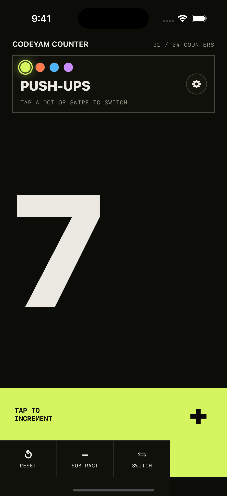
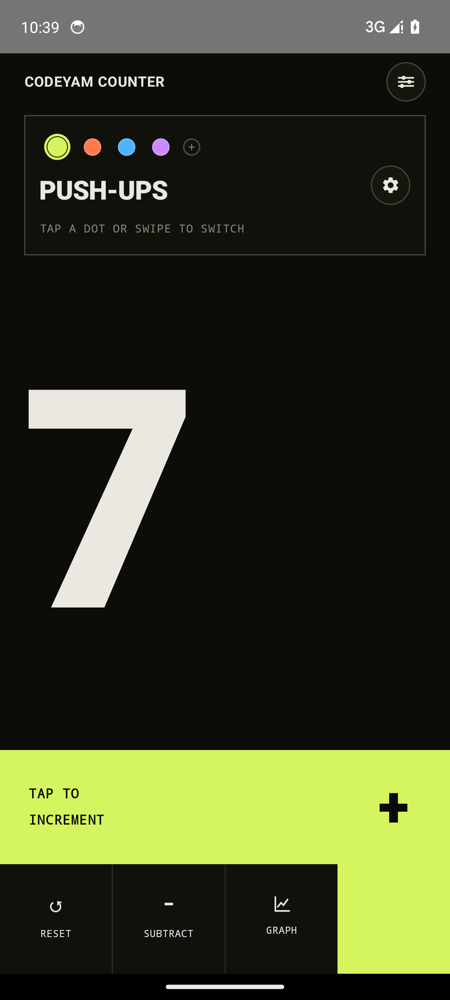
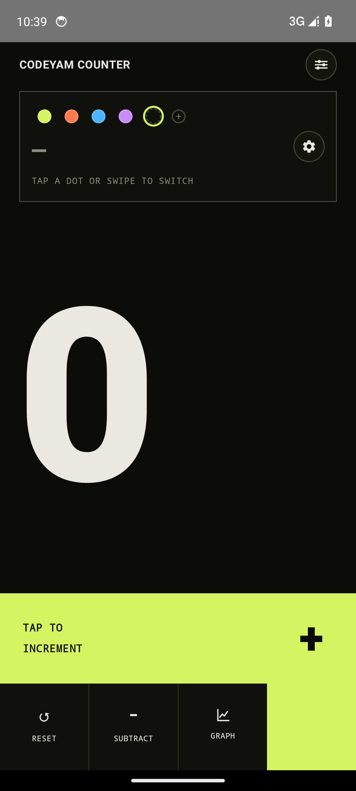
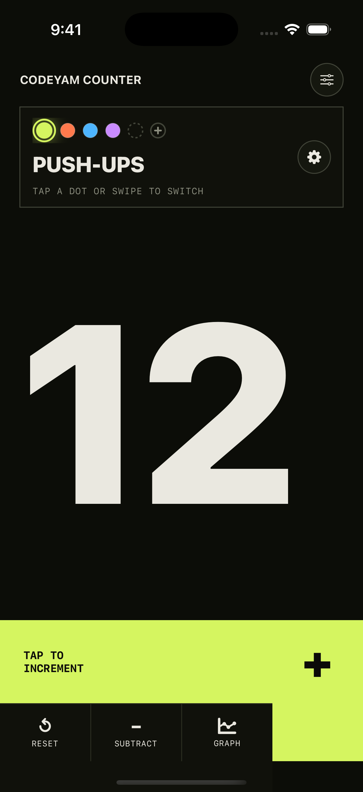
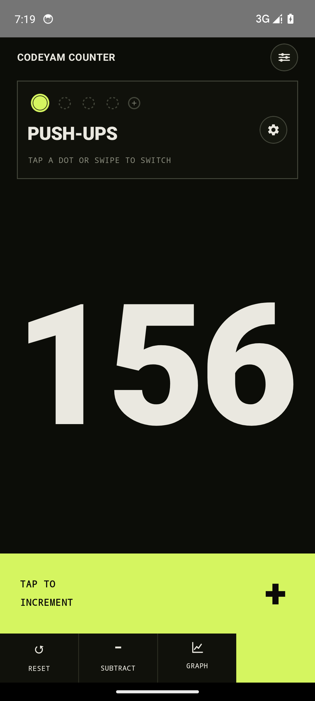
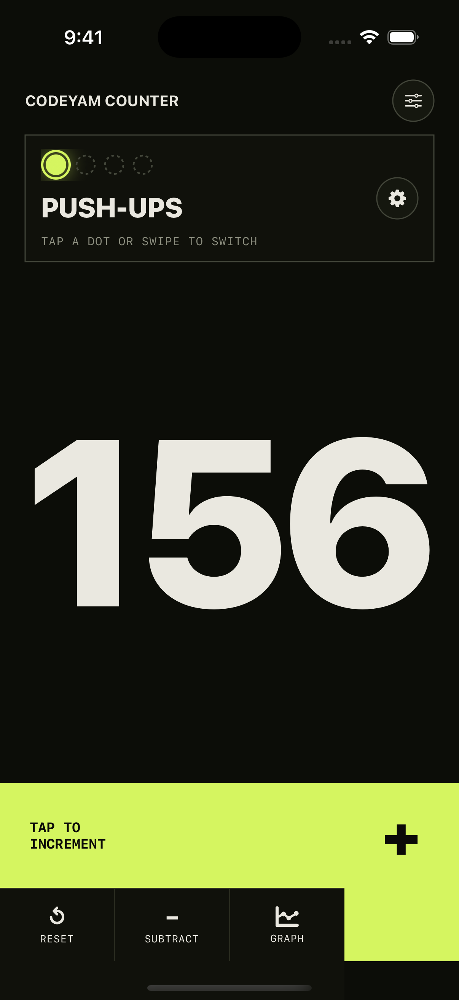
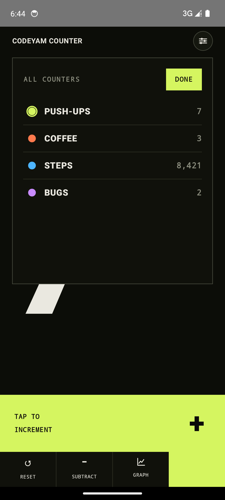
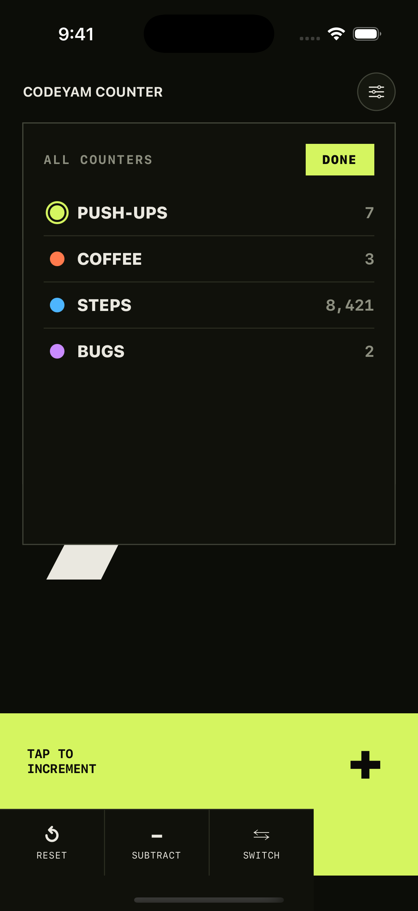

# CodeYam Counter

[](https://github.com/codeyam-ai/codeyam-counter/actions/workflows/ci.yml)
[](./LICENSE)

**A fast, tactile way to count anything.**

CodeYam Counter keeps several running tallies at once — reps, coffees, laps,
anything worth counting. Each counter gets its own name and color, one tap
increments, and every count is charted over time so you can see your history at
a glance.

**Download it free — [App Store](https://apps.apple.com/us/app/codeyam-counter/id6789247345) ·
[Google Play](https://play.google.com/store/apps/details?id=com.codeyam.counter)**

<p align="center">
  
  
</p>

<!-- codeyam:run-and-edit:start -->
## Develop this project with codeyam-editor

This project is built with [codeyam-editor](https://codeyam.com) — code and runnable data scenarios are authored side by side against a live preview.

```bash
# Clone the repo
git clone https://github.com/codeyam-ai/codeyam-counter && cd codeyam-counter

# Install codeyam-editor
npm install -g @codeyam-editor/codeyam-editor@latest

# Launch the editor (split-screen terminal + live preview)
codeyam-editor start
```
<!-- codeyam:run-and-edit:end -->

## Build and run locally

CodeYam Counter ships for **iOS** and **Android**, both driven by the same
scenarios. Build the platform you're working on — you only need that platform's
toolchain.

```bash
# Clone the repo
git clone https://github.com/codeyam-ai/codeyam-counter && cd codeyam-counter
```

### iOS

Built with SwiftUI on a shared `AppCore` SwiftPM library. Requires macOS with a
recent Xcode (Swift 6 toolchain) and an iOS 15+ simulator or device.

```bash
# Build the shared AppCore library and run the tests
swift build --package-path ios
swift test --package-path ios --parallel --disable-swift-testing --xunit-output .codeyam/swift-tests.xml
```

Open `ios/App.xcodeproj` in Xcode and run the **App** scheme on an iOS simulator or
device. See [IOS_SETUP.md](IOS_SETUP.md) for simulator prerequisites.

### Android

A native Kotlin + Jetpack Compose port lives in [`android/`](android/). Requires
JDK 17 and the Android SDK (compile SDK 35).

```bash
# Compile the sources and run the JVM unit tests
android/gradlew -p android compileDebugKotlin
android/gradlew -p android testDebugUnitTest

# Boot the Android emulator preview
codeyam-editor editor start-simulator kotlin-android-compose
```

See [ANDROID_SETUP.md](ANDROID_SETUP.md) for SDK/emulator prerequisites. Both
platforms are covered by [CONTRIBUTING.md](CONTRIBUTING.md) and run in CI on
every push and pull request.

<!-- codeyam:scenario-gallery:start -->
## Scenario gallery

States captured as runnable scenarios with codeyam-editor:

### Android Counter - Active count


### Counter - Active count


### Android Counter - Added blank slot selected



### Counter - Added blank slot selected



### Android Counter - All but one deleted



### Counter - All but one deleted



### Android Counter - All counters list



### Counter - All counters list


<!-- codeyam:scenario-gallery:end -->

## Contributing

Contributions are welcome! Please read [CONTRIBUTING.md](CONTRIBUTING.md) for
build/test instructions and the PR process, and note our
[Code of Conduct](CODE_OF_CONDUCT.md). To report a security issue, see
[SECURITY.md](SECURITY.md).

## License

[MIT](./LICENSE) © 2026 Codeyam
